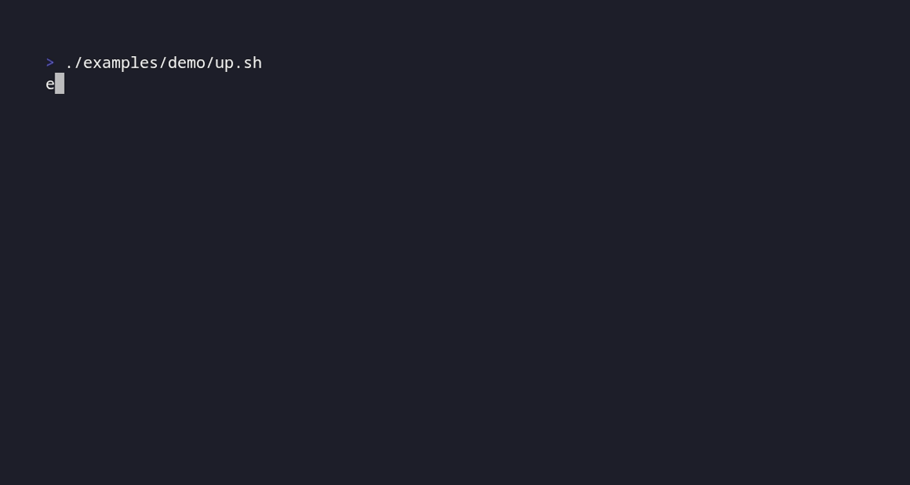
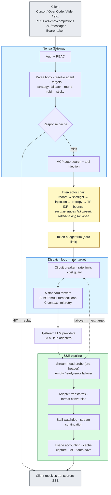

# Nenya AI Gateway

![go-version] ![License][license] ![zero-deps] ![CI][ci] ![CodeQL][codeql] ![Release][release] ![Sponsor][sponsor]

AI coding clients transmit your source code, prompts, and credentials to cloud LLM providers on every request. Nenya is the gatekeeper in between: a lightweight, zero-dependency API gateway that redacts secrets before they leave your machine, keeps context payloads small, and routes across providers with fallback, caching, and transparent SSE streaming. Security-hardened: non-root execution, mlock for secrets, seccomp + no-new-privileges.

**Compatible with any provider that implements the OpenAI Or Anthropic Chat Completions API.** For 23 providers we ship built-in adapters with specialized handling.



## Quick Start

### Run with Podman

Create minimal config and secrets:

```bash
mkdir -p config secrets
cat > config/config.json << 'EOF'
{
  "server": { "listen_addr": ":8080" },
  "agents": {
    "default": {
      "strategy": "fallback",
      "models": ["gemini-2.5-flash"]
    }
  }
}
EOF

cat > secrets/provider_keys.json << 'EOF'
{
  "provider_keys": {
    "gemini": "AIza..."
  }
}
EOF

cat > secrets/client.json << EOF
{
  "client_token": "nk-$(openssl rand -hex 32)"
}
EOF
```

Note: the last heredoc is unquoted on purpose, so `$(openssl rand -hex 32)` expands once while the file is written and your token is unique.

Run the container (the same flags work with `docker run`):

```bash
podman run -d \
  --name nenya \
  -p 8080:8080 \
  -v ./config:/etc/nenya:ro \
  -v ./secrets:/run/secrets/nenya:ro \
  -e NENYA_SECRETS_DIR=/run/secrets/nenya \
  --cap-drop=ALL \
  --cap-add=IPC_LOCK \
  --security-opt=no-new-privileges:true \
  --read-only \
  --tmpfs /tmp:rw,noexec,nosuid,size=64M \
  ghcr.io/gumieri/nenya:latest
```

Test it — the authenticated smoke test must list your configured model:

```bash
export NK=$(jq -r '.client_token' secrets/client.json)

curl -s -H "Authorization: Bearer $NK" http://localhost:8080/v1/models | jq -r '.data[].id'
```

Then send your first completion (streams an SSE response):

```bash
curl -N -H "Authorization: Bearer $NK" \
  -d '{"model":"gemini-2.5-flash","messages":[{"role":"user","content":"Say hi in five words"}]}' \
  http://localhost:8080/v1/chat/completions
```

No API key yet? The [offline redaction demo](examples/demo/) runs Nenya against a local mock upstream — no external calls, no keys. It generates dummy secrets, sends fake AWS/GitHub credentials through the gateway, and shows what the upstream actually receives. Regenerate the GIF above with `mise run demo`.

### Install via Package Manager

Nenya provides native packages for major Linux distributions and community package managers:

| Distribution | Command |
|-------------|---------|
| **Debian/Ubuntu (.deb)** | Download `nenya_<version>_linux_amd64.deb` from the release page and run `sudo dpkg -i` |
| **Fedora/RHEL (.rpm)** | Download `nenya-<version>.x86_64.rpm` from the release page and run `sudo rpm -i` |
| **Arch Linux (.pkg.tar.zst)** | Download `nenya-<version>-x86_64.pkg.tar.zst` from the release page and run `sudo pacman -U` |
| **Arch Linux (AUR)** | `yay -S nenya-bin` (or your preferred AUR helper) |
| **Nix/NixOS** | Add `gumieri/nur-packages` to your NUR registry and use `nenya` |

All packages install the binary to `/usr/bin/nenya` and include systemd service and socket units. After install, enable and start:

```bash
sudo systemctl enable --now nenya.socket
sudo systemctl enable --now nenya.service
```

### Deployment Guides

- **[Deploy Bare Metal (systemd)](docs/DEPLOY_BAREMETAL.md)** — Direct binary install, socket activation, hot reload
- **[Deploy Container (Podman/Docker Compose)](docs/DEPLOY_CONTAINER.md)** — compose.yml, image verification, security hardening
- **[Deploy Kubernetes (Helm)](docs/DEPLOY_KUBERNETES.md)** — Helm chart, ConfigMap/Secret, ingress setup

## Why Nenya

- **Single static binary, zero runtime dependencies** — Go standard library only. No plugins, no interpreters, no sidecars to install or upgrade.
- **Privacy-first by default** — the Tier-0 regex filter redacts AWS keys, GitHub tokens, passwords, and similar secrets before any payload leaves your machine; optional entropy filtering, TF-IDF pruning, and engine summarization shrink what does get sent.
- **Transparent compatibility** — drop-in OpenAI- and Anthropic-compatible endpoints. Your clients keep working unchanged; providers are swappable config, not code.
- **Resilient routing** — fallback chains with circuit breakers, upstream rate-limit awareness, stream-head failover, and sticky sessions that keep provider-side prefix caches warm.
- **Hardened service** — mlock-sealed secrets, seccomp and no-new-privileges, non-root containers, read-only filesystem, systemd socket activation for zero-downtime restarts.

## How Nenya handles requests



Flow notes:
- `/v1/*` endpoints require client bearer auth; `/healthz`, `/statsz`, `/metrics` do not.
- Pipeline failures degrade gracefully and forward the request instead of returning a 500.
- MCP-enabled agents can run local/remote tools without exposing MCP complexity to the client.
- Sticky strategy pins a session (agent + system prompt + first user message) to one provider/model, keeping provider-side prefix caches warm across turns.
- Upstream streams are probed before headers commit: empty streams or early SSE errors fail over to the next target, and interrupted streams are auto-resumed via stream continuation.

## Features

### Routing & Agents

- **Config-driven provider registry** — add providers via JSON, zero code changes
- **23 built-in providers** with specialized adapters for wire format differences
- **Dynamic model discovery** — fetches live model catalogs from providers at startup and on reload
- **Model registry** — reference models by string shorthand with automatic provider/context resolution
- **Multi-provider model resolution** — when a model exists in multiple providers, all are added to the agent's fallback chain
- **Three-tier model resolution** — config overrides > discovered models > static registry
- **Per-model wire format** — models from multi-format gateways (OpenCode Zen) auto-convert between OpenAI, Anthropic, and Gemini wire formats based on the model's `format` attribute
- **Agent fallback chains** — round-robin or sequential with circuit breaker and automatic failover
- **Latency-aware routing** — auto-reorder targets by historical median response time with ±5% jitter to prevent thundering herd
- **Per-agent system prompts** — inline or file-based

### Security & Privacy

- **Tier-0 regex secret filter** — always-on redaction of AWS keys, GitHub tokens, passwords, etc.
- **3-Tier content pipeline** — pluggable interceptor chain: regex redaction, entropy filtering, TF-IDF relevance scoring, engine summarization
- **Context window compaction** — sliding window summarization with configurable engine
- **Stale tool call pruning** — compact old assistant+tool response pairs to save tokens
- **Thought pruning** — strip reasoning blocks from assistant message history
- **Prompt-injection defense** — deterministic detection/sanitization, untrusted-content spotlighting, and an advisory two-tier classifier (see [docs/INJECTION_DEFENSE.md](docs/INJECTION_DEFENSE.md))
- **Output egress control** — ExfilGuard URL policy and canary tripwires on every egress channel
- **System One decision models** — `POST /v1/systemone` proxies TypeSafe Jev typed-decision requests (noul/choice/score) through Nenya, with a non-chat model guard keeping them out of chat routing (see [docs/SYSTEM_ONE.md](docs/SYSTEM_ONE.md))
- **Input validation** — strict body limits, JSON sanitization, header filtering
- **Graceful degradation** — with `bouncer.fail_open=true` (the default), engine and token-saving pipeline failures never block requests; security interceptors fail closed by design (503) so a broken defense cannot silently pass content
- **Role-Based Access Control (RBAC)** — per-API key roles (admin, user, read-only) with agent and endpoint restrictions

### Hardening (Deployment Security)

- **Secure memory (default)**: All tokens stored in mlock-protected RAM, sealed read-only after init, core dumps disabled
- **Non-root execution** — runs as UID 65532 with dropped capabilities
- **Memory protection** — `LimitMEMLOCK=infinity` and `LimitCORE=0` in systemd
- **Read-only filesystem** — immutable root + private `/tmp`
- **Seccomp + no-new-privileges** — restricted syscalls, prevents privilege escalation
- **Zero-trust secrets** — loaded via systemd credentials or container mounts, never to disk
- **Socket activation** — seamless restarts with zero dropped connections

### Reliability

- **Zero external dependencies** — Go standard library only
- **Hot reload** — `systemctl reload nenya` for zero-downtime config changes
- **Circuit breaker** — per agent+provider+model with automatic failover, exponential backoff, and semantic error classification
- **Rate limiting** — per upstream host (RPM/TPM) with per-provider overrides
- **Response cache** — in-memory LRU with SHA-256 fingerprinting and optional semantic similarity search
- **Graceful shutdown** — 30s grace period for in-flight requests, MCP client cleanup
- **Context-limit auto-retry** — upstream context-length errors trigger summarization and retry
- **Local engine lifecycle** — pre-load and manage local Ollama models with LRU eviction
- **Structured errors** — all error responses include `error_kind` field for programmatic diagnostics

### MCP Tool Integration

- **Tool discovery** — connect to MCP servers for automatic tool injection
- **Multi-turn execution** — intercept tool calls, execute against MCP servers, forward results
- **Auto-search** — pre-fetch relevant context from MCP servers before forwarding
- **Auto-save** — persist assistant responses to MCP memory servers

## API Endpoints

All `/v1/*` endpoints require `Authorization: Bearer <client_token>` or `Bearer <api_key_token>`.
API keys support **RBAC enforcement** — agent scoping, endpoint allowlists, role-based permissions (admin bypasses all checks).

| Endpoint | Auth | Description |
|----------|------|-------------|
| `POST /v1/chat/completions` | Bearer + RBAC | OpenAI-compatible chat with SSE streaming, agent fallback, MCP multi-turn |
| `POST /v1/messages` | Bearer + RBAC | Anthropic Messages API with bidirectional format conversion |
| `GET /v1/models` | Bearer + RBAC | Live model catalog from discovered providers + static registry (context window, max tokens) |
| `POST /v1/embeddings` | Bearer + RBAC | Passthrough proxy |
| `POST /v1/responses` | Bearer + RBAC | Passthrough proxy |
| `POST /v1/images/generations` | Bearer + RBAC | Image generation (OpenAI-compatible) |
| `POST /v1/audio/transcriptions` | Bearer + RBAC | Audio transcription (Whisper-compatible, multipart support) |
| `POST /v1/audio/speech` | Bearer + RBAC | Text-to-speech synthesis (OpenAI-compatible) |
| `POST /v1/moderations` | Bearer + RBAC | Content moderation (OpenAI-compatible) |
| `POST /v1/rerank` | Bearer + RBAC | Re-ranking API (Cohere/Jina/Voyage-compatible) |
| `POST /v1/a2a` | Bearer + RBAC | Agent-to-Agent protocol (Google A2A) |
| `GET/POST/DELETE /v1/files` | Bearer + RBAC | File listing, upload, retrieval, deletion |
| `POST/GET /v1/batches` | Bearer + RBAC | Batch API operations |
| `POST /proxy/{provider}/*` | Bearer + RBAC | Arbitrary provider endpoint passthrough (all HTTP methods, SSE streaming) |
| `GET /healthz` | None | Engine health probe |
| `GET /statsz` | None | Token usage, circuit breaker state, MCP server status |
| `GET /metrics` | None | Prometheus-compatible metrics |
| `GET /debug/pprof/*` | Bearer | Go profiling endpoints (disabled by default, see `debug.pprof_enabled`) |

See [`docs/PASSTHROUGH_PROXY.md`](docs/PASSTHROUGH_PROXY.md) for detailed passthrough proxy usage.

## Runtime Configuration

Nenya supports standard environment variables for deployment portability:

| Variable | Default | Description |
|----------|---------|-------------|
| `PORT` | `8080` | Listening port (overrides `server.listen_addr`) |
| `HOST` | — | Optional bind address (e.g. `127.0.0.1`). Only used when combined with `PORT` |
| `NENYA_CONFIG_DIR` | `/etc/nenya/` | Configuration directory path |
| `NENYA_CONFIG_FILE` | — | Single config file path (takes precedence over `NENYA_CONFIG_DIR`) |
| `NENYA_SECRETS_DIR` | `/run/secrets/nenya` | Secrets directory; used only when `CREDENTIALS_DIRECTORY` does not supply secrets |

Example usage:
```bash
PORT=9090 HOST=127.0.0.1 ./nenya --config /path/to/config.json
```

Or in Docker:
```bash
docker run -e PORT=9090 -p 9090:9090 ghcr.io/gumieri/nenya:latest
```

## Documentation

| Document | Description |
|----------|-------------|
| [Consumer Contract](CONTRACT.md) | External interface contract for managers/tooling: CLI surface, on-disk layout and precedence, release artifacts, service units, HTTP surface, versioning |
| [Providers](docs/PROVIDERS.md) | All 23 providers, capabilities matrix, special behaviors, adding custom providers |
| [Configuration](docs/CONFIGURATION.md) | Full config reference, directory mode, all sections and fields |
| [Deploy Bare Metal](docs/DEPLOY_BAREMETAL.md) | Systemd unit, config.d layout, secrets, hot reload |
| [Deploy Container](docs/DEPLOY_CONTAINER.md) | Podman/Docker Compose, image verification, security notes |
| [Deploy Kubernetes](docs/DEPLOY_KUBERNETES.md) | Helm chart usage, ConfigMap/Secret, ingress setup |
| [Passthrough Proxy](docs/PASSTHROUGH_PROXY.md) | Raw provider endpoint proxying, SSE streaming, auth injection |
| [Architecture](docs/ARCHITECTURE.md) | Package DAG, request lifecycle, circuit breaker, SSE pipeline |
| [MCP Integration](docs/MCP_INTEGRATION.md) | MCP server integration, tool discovery, multi-turn execution |
| [Injection & Exfiltration Defense](docs/INJECTION_DEFENSE.md) | Threat model, defense-in-depth layers, rollout playbook, honest limitations |
| [Adapters](docs/ADAPTERS.md) | Adapter system internals, auth styles, capability flags |
| [System One Decision Models](docs/SYSTEM_ONE.md) | TypeSafe Jev integration: `/v1/systemone`, non-chat model guard, usage metrics |
| [Secrets Format](docs/SECRETS_FORMAT.md) | Systemd credentials, env var fallback, container/K8s deployment |
| [Security](docs/SECURITY.md) | Vulnerability reporting policy |
| [Disclaimer](docs/DISCLAIMER.md) | Best-effort redaction scope and limitations |
| [Changelog](CHANGELOG.md) | Release history and notable changes |

## License

Apache 2.0. See [`LICENSE`](LICENSE).

---

[go-version]: https://img.shields.io/badge/Go-1.26-00ADD8?logo=golang&logoColor=white
[license]: https://img.shields.io/badge/License-Apache_2.0-5B44C2?logo=apache&logoColor=white
[zero-deps]: https://img.shields.io/badge/Dependencies-0-2EA043?logo=golang&logoColor=white
[ci]: https://img.shields.io/github/actions/workflow/status/gumieri/nenya/ci.yml?branch=main&logo=github&logoColor=white&label=CI
[codeql]: https://img.shields.io/github/actions/workflow/status/gumieri/nenya/codeql.yml?branch=main&logo=github&logoColor=white&label=CodeQL
[release]: https://img.shields.io/github/v/release/gumieri/nenya?logo=github&logoColor=white&sort=semver
[sponsor]: https://img.shields.io/badge/Sponsor-GitHub-EA4AAA?logo=githubsponsors&logoColor=white
